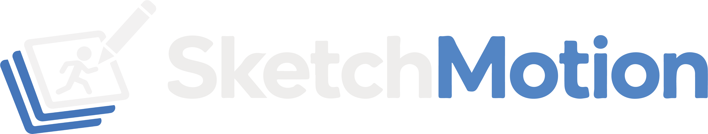

  

  Software desktop de desenho, camadas, animação 2D e rigging — construído em Rust.

---

## Sobre

SketchMotion é um projeto pessoal de software de criação e animação 2D,
inspirado em ferramentas como Aseprite, Krita e OpenToonz. O objetivo é reunir
desenho, camadas, animação quadro a quadro e rigging 2D (esqueletos
articulados) em uma única aplicação nativa, com foco em desempenho.

Este repositório documenta o processo completo de construção — da concepção e
arquitetura até a implementação incremental — e serve também como registro de
portfólio.

## Documentação

| Documento | Conteúdo |
|---|---|
| [`docs/00-visao-geral.md`](docs/00-visao-geral.md) | Objetivos do software e decisões principais |
| [`docs/01-arquitetura.md`](docs/01-arquitetura.md) | Módulos, responsabilidades e fluxo de dados |
| [`docs/02-stack-tecnologica.md`](docs/02-stack-tecnologica.md) | Linguagem, crates e justificativas técnicas |
| [`docs/03-design-system.md`](docs/03-design-system.md) | Identidade visual e paleta de cores |
| [`docs/04-estrutura-pastas.md`](docs/04-estrutura-pastas.md) | Organização do workspace Rust |
| [`docs/05-roadmap-mvp.md`](docs/05-roadmap-mvp.md) | Plano de versões incrementais |
| [`docs/06-plano-de-execucao.md`](docs/06-plano-de-execucao.md) | Fases e etapas concretas para começar a implementação |

## Status

🚧 Em planejamento — fase de documentação e arquitetura, anterior à primeira
linha de código de implementação.

## Stack

Rust · skia-safe · egui · glam · serde

## Licença

A definir.
