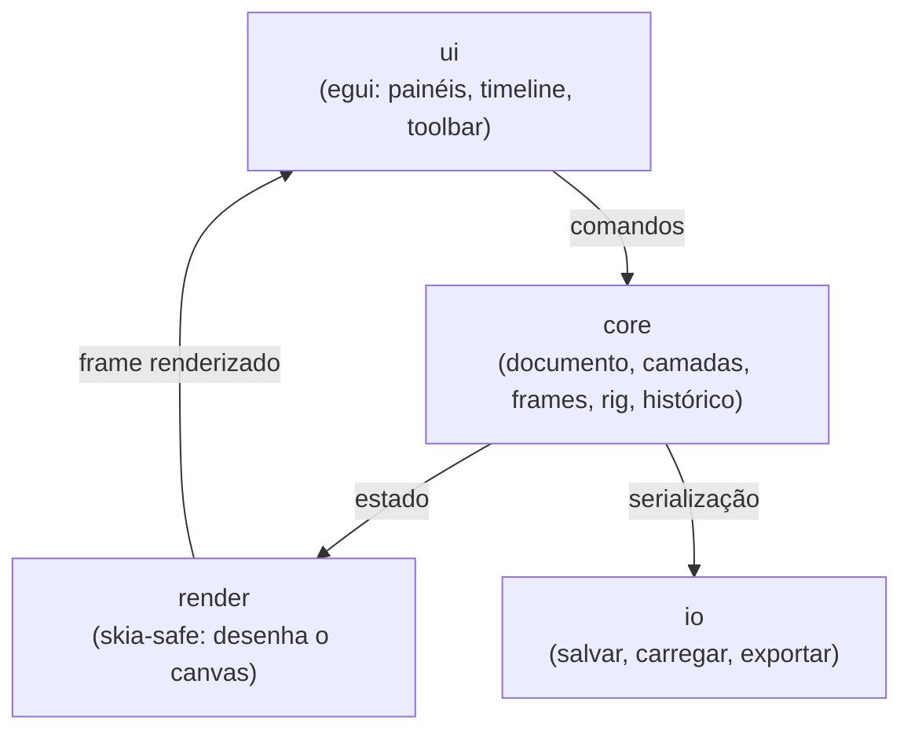

# Arquitetura

## Princípio geral

O núcleo do documento (`core`) é a fonte única da verdade. Nem a renderização
(`render`) nem a persistência (`io`) se comunicam diretamente entre si — ambas leem
e reagem a mudanças no `core`. A interface (`ui`) só fala com o `core` através de
comandos, nunca manipula o estado do documento diretamente. Essa separação existe
para permitir:

- Trocar o motor de renderização ou a lib de UI no futuro sem tocar no modelo de
  dados.
- Testar o núcleo (regras de camadas, frames, rig) sem precisar abrir uma janela.
- Um sistema de undo/redo centralizado e confiável, baseado em comandos, não em
  cópias de estado espalhadas pela UI.

## Visão macro

## Módulos e responsabilidades

### `core` — modelo de documento
- `Document`: metadados do projeto (dimensões, FPS padrão, cor de fundo).
- `Layer`: nome, visibilidade, bloqueio, opacidade, grupo, ordem.
- `Frame`: conteúdo raster/vetorial de uma camada em um instante da timeline,
  duração.
- `Rig`: hierarquia de ossos (bone tree), pivôs, associação de imagem por
  segmento.
- `History`: pilha de comandos (undo/redo) — todo mutação no documento passa por
  um `Command` reversível.
- Não depende de `render`, `ui` nem `io`. É a única parte do sistema com 100% de
  cobertura de testes unitários viável sem mocks pesados.

### `render` — renderização do canvas
- Consome o estado do `core` (camadas visíveis, frame atual, transformações do
  rig) e desenha via `skia-safe`.
- Responsável por: composição de camadas com opacidade e blending, onion skin
  (frame anterior/posterior com transparência), grade/guias, indicadores de
  seleção.
- Não modifica o `core` — é somente leitura.

### `tools` — ferramentas de desenho e edição
- Máquina de estados por ferramenta (lápis, pincel, borracha, balde, seleção,
  formas).
- Traduz eventos de entrada (posição, pressão, botão) em `Command`s aplicados ao
  `core`.
- Cada ferramenta é um módulo independente implementando um trait comum — permite
  adicionar novas ferramentas sem alterar as existentes.

### `input` — abstração de dispositivos
- Normaliza eventos de mouse, teclado e caneta/mesa digitalizadora (pressão,
  tilt) antes de chegar em `tools`.
- Isola a biblioteca de janelas (`winit`, usada via `egui`/`eframe`) do resto do
  sistema.

### `animation` — timeline e reprodução
- Gerencia frames por camada, duração individual, FPS, reprodução e navegação.
- Onion skin é configurado aqui (quantos frames, intensidade), mas desenhado
  pelo `render`.

### `rigging` — esqueletos 2D
- Estrutura hierárquica de ossos (pai/filho), pivôs e transformações
  (posição, rotação, escala) que se propagam pela hierarquia.
- V1: FK simples (forward kinematics) — mover um osso move os filhos.
- Preparado para IK (inverse kinematics), limites de rotação e keyframes no
  futuro, sem exigir redesenho da estrutura de dados.

### `color` / `brush`
- `color`: paleta, seletor de cores, histórico de cores usadas.
- `brush`: presets de pincel (tamanho, dureza, opacidade), independente da
  ferramenta que o usa.

### `io` — importação e exportação
- Formato próprio do projeto (serialização via `serde`), preservando camadas,
  frames, rig e configurações.
- Exportadores: PNG, GIF animado, sequência de PNG (v1); SVG avaliado para uma
  versão futura.

### `ui` — interface (egui)
- Toolbar superior, painel de ferramentas, painel de camadas/propriedades/cores,
  canvas central, timeline inferior.
- Único módulo que depende de `core`, `render`, `tools` e `io` ao mesmo tempo —
  é a camada de composição, não de regras de negócio.

## Por que essa separação importa para o rig

O sistema de esqueletos é o módulo mais arriscado tecnicamente (hierarquia de
transformações, propagação de movimento pai→filho). Mantê-lo isolado em
`rigging`, operando só sobre dados do `core` e sem saber nada de `render` ou
`ui`, permite testar a matemática da hierarquia (com `glam`) de forma isolada,
antes mesmo de haver uma tela para desenhar.

## Workspace Cargo

Cada módulo acima corresponde a uma crate dentro de um Cargo workspace (ver
[`04-estrutura-pastas.md`](./04-estrutura-pastas.md)), não a uma pasta solta
dentro de um único crate. Isso força as fronteiras de dependência a serem
explícitas — se `render` tentar importar algo de `ui`, o compilador acusa.
